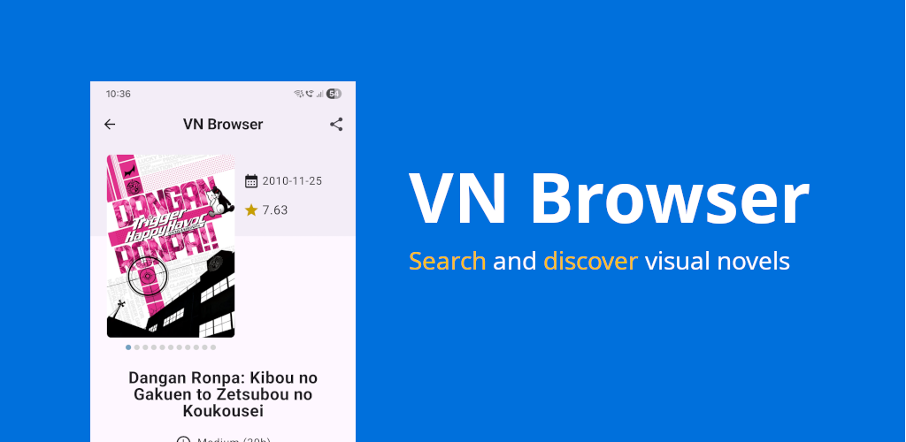
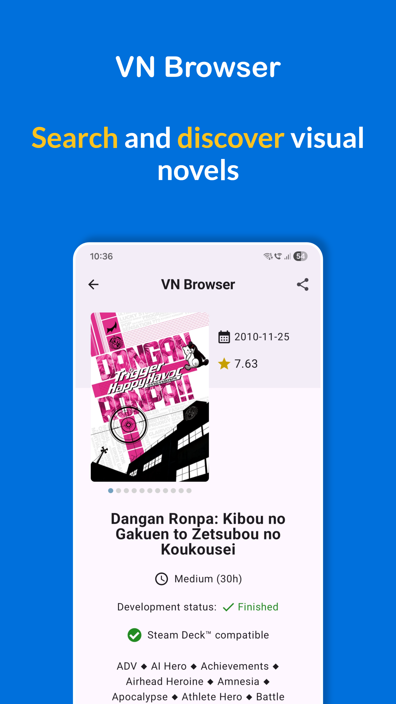
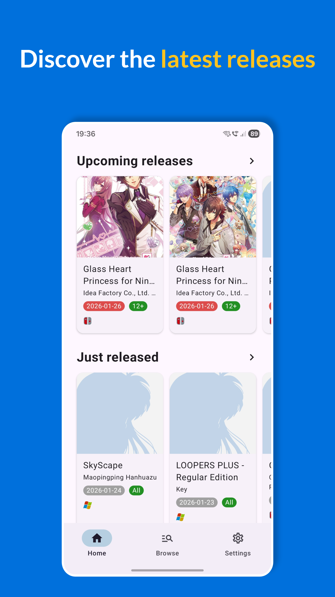
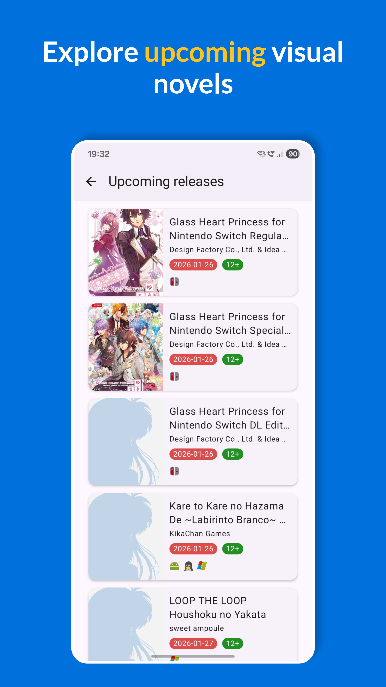
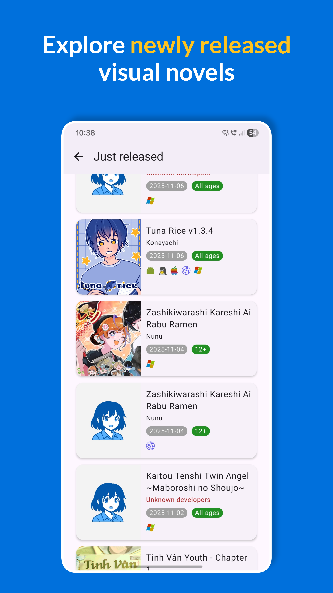
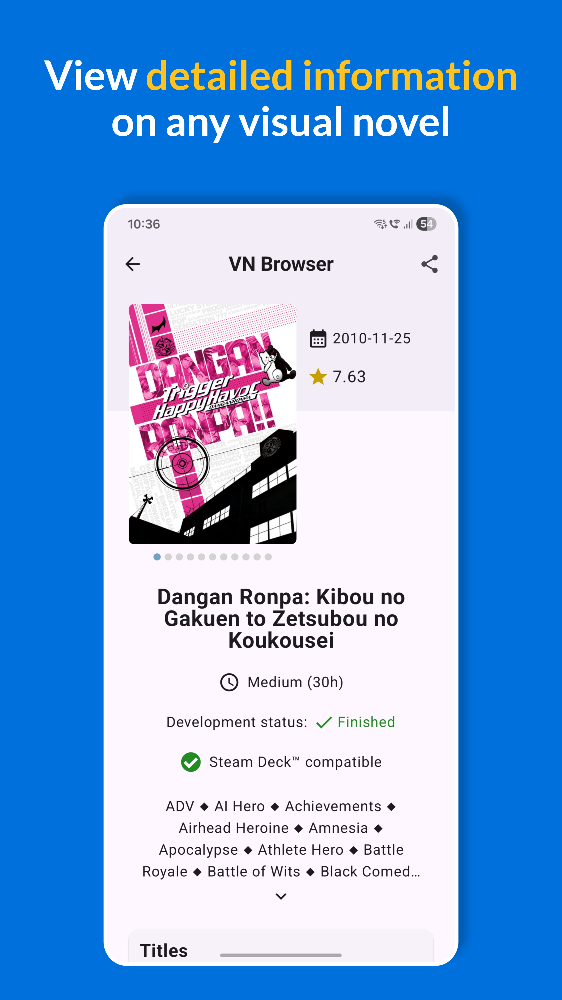
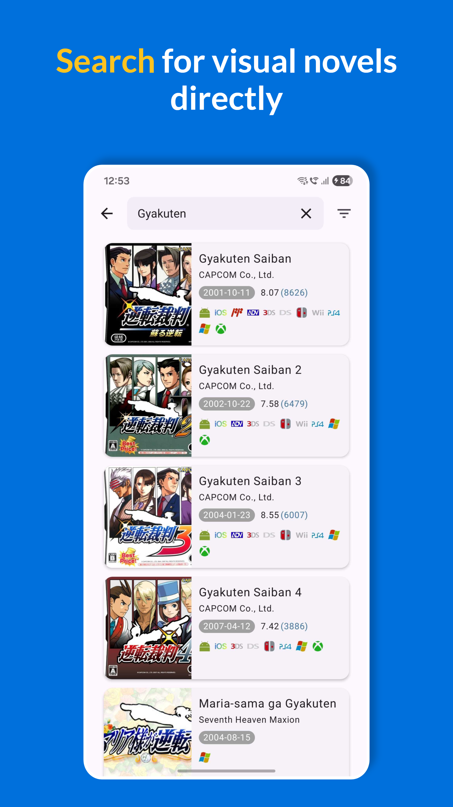

### VN Browser
Unofficial Android client for [VNDB (The Visual Novel Database)](https://vndb.org/).
### Search and discover visual novels.
 

🟢 [Get it on Google Play](https://play.google.com/store/apps/details?id=com.cmgapps.vnbrowser)  
Google Play is recommended. The APK is provided for manual installs or devices without Play.

💾 [Download APK (Latest)](https://github.com/chrmargra/vn-browser-android/releases/latest)

📝 [Changelog / Releases](https://github.com/chrmargra/vn-browser-android/releases)

✅ **Requirements:** Android **12+** (API 31)

### Overview

Find your next visual novel fast ✨. VN Browser is a clean, modern catalog to discover and track
visual novels by name, platform, language and release date. Explore in seconds, then jump to the
official pages for deeper info.

### 📸 Screenshots:

<!-- markdownlint-disable MD033 -->

  
  
  
  

  
  
  

<!-- markdownlint-enable MD033 -->

### 🔎 **What you can do:**  

➤ Search & filter by title, platforms, languages and release date.  
➤ Browse curated lists: upcoming releases, just released and popular classics.  
➤ See key info at a glance: release dates, ratings, platforms and content notes.  
➤ Open official resources quickly (e.g. VNDB and other reference links).  
➤ Report entries: open the VNDB report page from any title’s details.  
➤ Light/Dark theme that follows your system setting.

### 🧭 **Maturity controls:**  

Mature (18+) titles are hidden by default. You can enable them in Settings after an age check and a
confirmation prompt. Covers are blurred by default.

### 🔐 **Privacy & data:**  

➤ No account required. No ads.  
➤ The app does not collect or sell personal data.  
➤ Basic crash diagnostics may be used to improve stability.

### 📚 **About the data:**  

Content is shown from the Visual Novel Database (VNDB). VN Browser is an independent app and is not
affiliated with or endorsed by VNDB or any rights holders. It does not host or distribute visual
novel content, only metadata and links to official pages.
