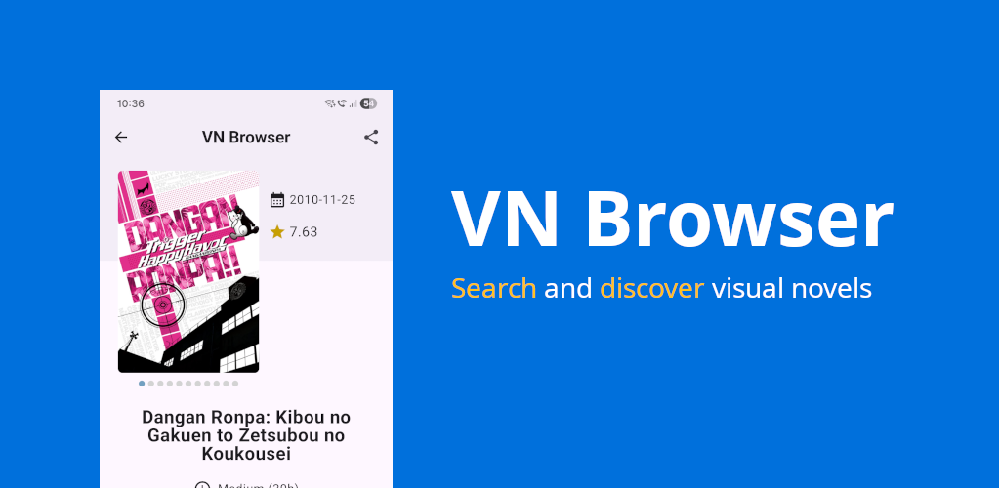
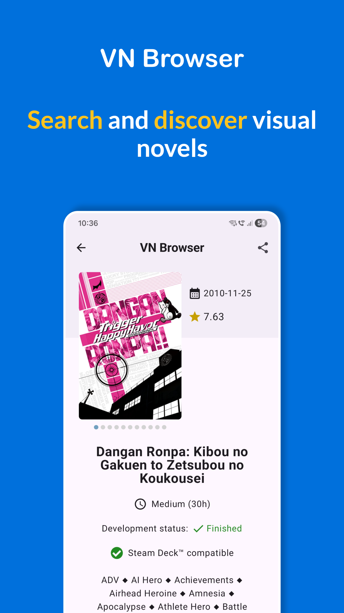
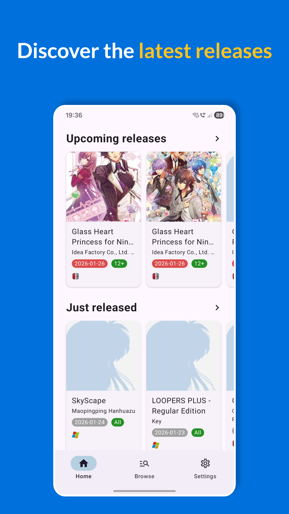
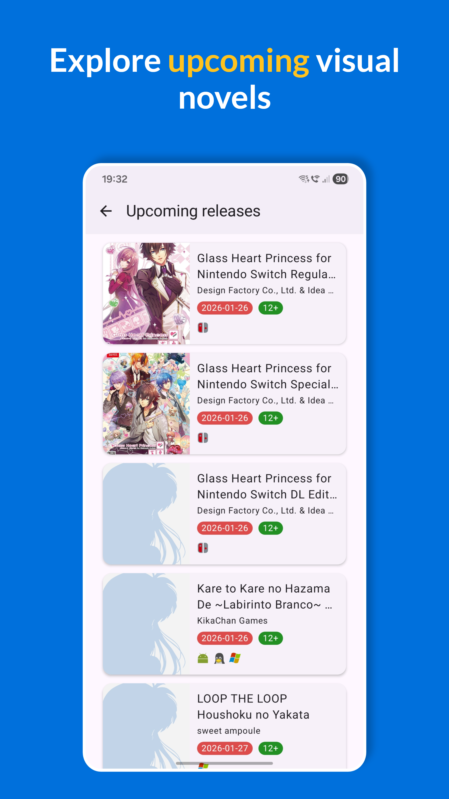
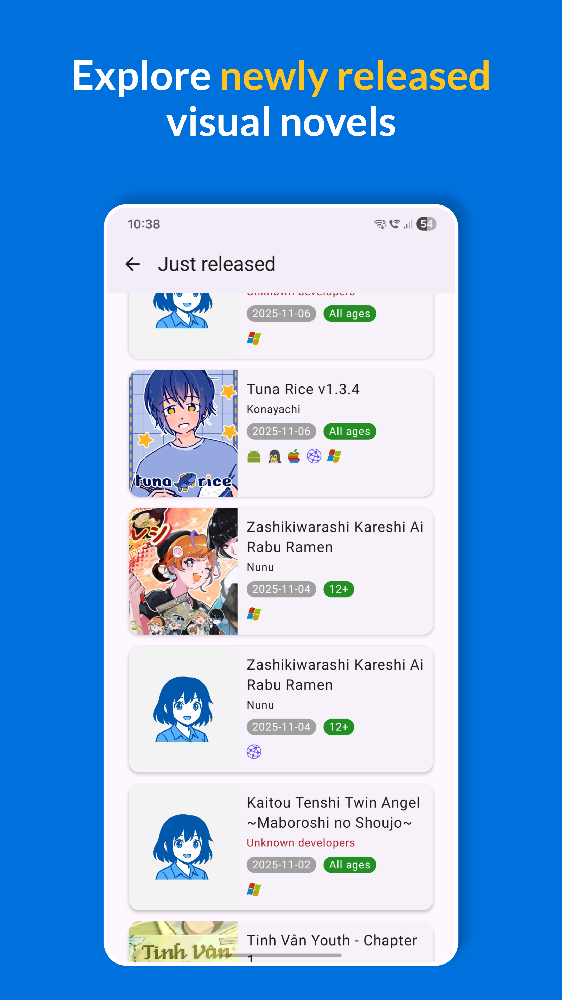
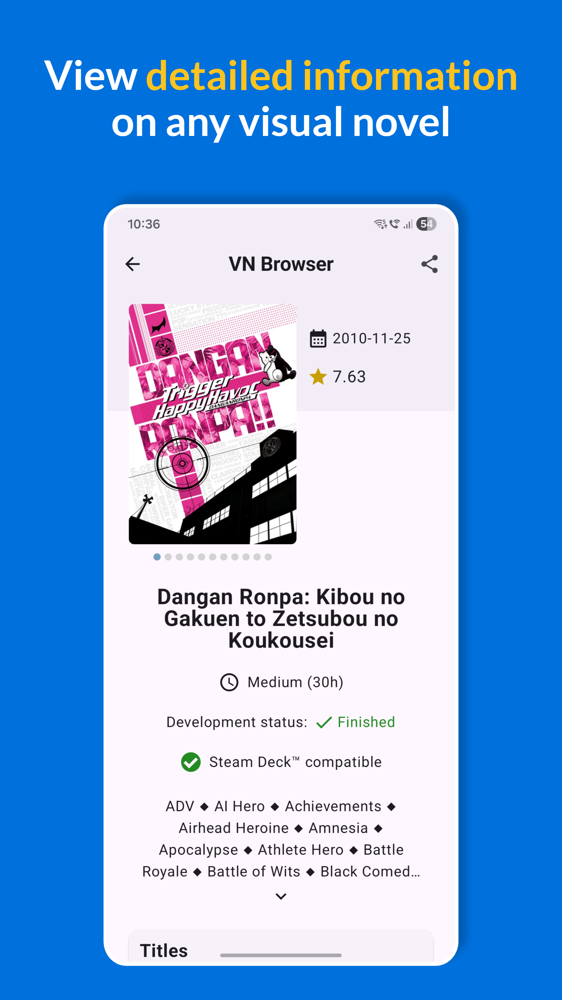
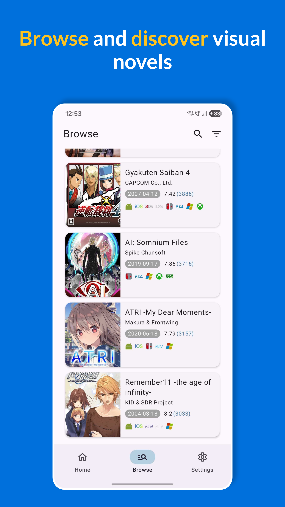
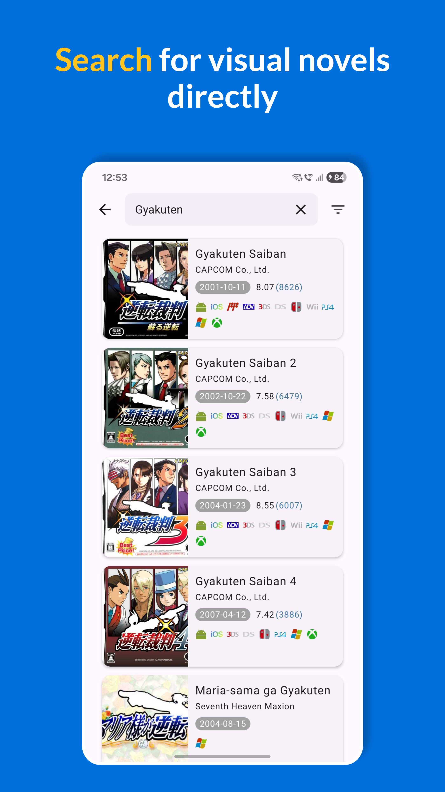

### VN Browser
The unofficial Android client for [VNDB (The Visual Novel Database)](https://vndb.org/)

 

### Search and discover visual novels
 

**Google Play is recommended**. The APK is for devices without Google Play services (or where
it isn't available). It requires a **manual installation**, and **updates won't be automatic.**

💾 [APK (Latest)](https://github.com/chrmargra/vn-browser-android/releases/latest)

📝 [Changelog / Releases](https://github.com/chrmargra/vn-browser-android/releases)

🔒 [Privacy Policy](https://devchristianmartin8.wixsite.com/policy-vn-browser)

🧑‍💻 **Developer**: [CMG Apps](https://play.google.com/store/apps/dev?id=7948300751358149534)

✉️ **Support**: [devchristianmartinez@gmail.com](mailto:devchristianmartinez@gmail.com)

✅ **Requirements:** Android **12+** • Requires an internet connection

### Overview

Find your next visual novel fast ✨ VN Browser is a fast, modern VNDB client for discovering and tracking visual novels by title, platform, language, and release date. Explore in seconds, then jump to VNDB pages and other links for more details.

### 📸 Screenshots

    
    
    

    
    
    

    

### 🔎 What you can do

➤ Search & filter by title, platforms, languages and release dates.  
➤ Browse curated lists: upcoming releases, just released and popular classics.  
➤ Open full details for visual novels and releases (editions, platforms, dates), plus character lists and game images.  
➤ Quickly check the essentials at a glance: ratings, platforms, release dates, and content notes.  
➤ When Mature mode is enabled, a random visual novel option appears, offering a more playful way to discover titles.  
➤ Optional in-app sound effects (off by default): enable them in Settings and discover which visual novels come alive with audio.  
➤ Open reference resources quickly (e.g. VNDB and other helpful links).  
➤ Report entries directly from any title's details (takes you to the VNDB report page).  
➤ Light/Dark theme that follows your system setting.

### 🧭 Maturity controls

Mature (18+) titles are hidden by default. You can enable them in Settings after an age check and a confirmation prompt. Covers are blurred by default, and turning blur off requires confirmation.

### 🔐 Privacy & data

➤ No account required. No ads.  
➤ The app does not sell personal data and does not use cross-app tracking.  
➤ Crash reports and in-app configuration may be used to improve stability and deliver updates/messages inside the app.

### 🛡️ Data safety & permissions

To keep things transparent, here’s a snapshot of the app’s data and permission footprint:

- **Data sharing:** Not sold and not shared with third parties for advertising or profiling.

- **Data collected (for app functionality & stability):**
  - Crash logs.
  - Diagnostics.
  - Device IDs (for diagnostics only).

- **Security:** Data is encrypted in transit.

- **Deletion:** There is no in-app data deletion request flow for collected diagnostics data.

- **Content rating:** Parental guidance recommended.

- **Permissions used:**
  - View network connections.
  - Full network access.
  - License verification (Google Play).

### 📚 About the data

Content is provided by [The Visual Novel Database (VNDB)](https://vndb.org/). VN Browser is an independent app and is not affiliated with or endorsed by VNDB or any rights holders. It does not host or distribute visual novel content, only metadata and links to VNDB pages.

### 💡 Suggestions & feedback

Have an idea, found a bug, or want to request a feature?

➤ **Feature requests / ideas:** open an issue and describe your use case.  
➤ **Bug reports:** include steps to reproduce, screenshots (if relevant), your device, and Android version.  
➤ **Security / privacy concerns:** please contact the developer by email.

🗂️ **GitHub Issues:** [https://github.com/chrmargra/vn-browser-android/issues](https://github.com/chrmargra/vn-browser-android/issues)  

📩 **Email:** [devchristianmartinez@gmail.com](mailto:devchristianmartinez@gmail.com)

Google Play and the Google Play logo are trademarks of Google LLC.
